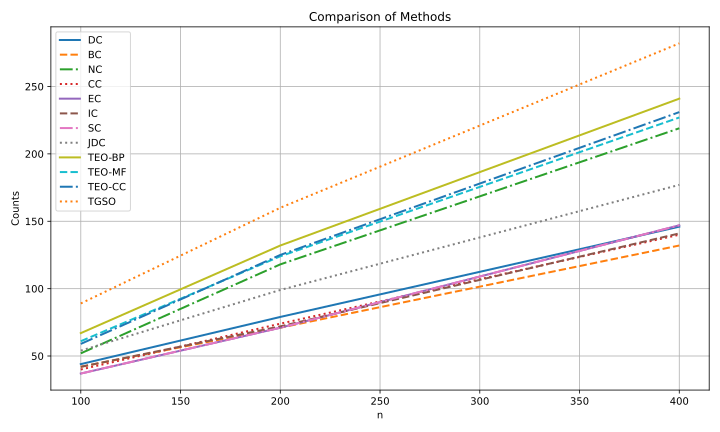
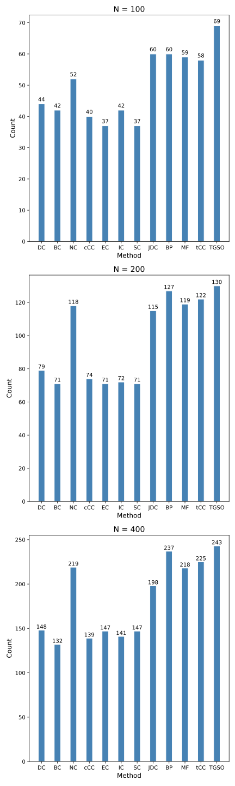

<div align="center">
    <h1>
    CenProteo: Finding the Essential Proteins in a Protein Interaction Network
    </h1>
    <p>
    Project of BIO2502 Programming Languages for Bioinformatics, 2024 Spring, SJTU
    <br />
    <a href="https://github.com/xywawawa"><strong>xywawawa</strong></a>
    &nbsp;
    <a href="https://github.com/Cannizzaro-reaction"><strong>Cannizzaro-reaction</strong></a>
    &nbsp;
    <a href="https://github.com/Imiloin"><strong>Imiloin</strong></a>
    &nbsp;
    </p>
    <p>
    <a href="https://github.com/Imiloin/CenProteo"></a>
    <a href="https://github.com/Imiloin/CenProteo?tab=MIT-1-ov-file"></a>
    </p>
    
</div>

在过去的几十年中，对于单一蛋白质的性质及功能方面的研究取得了很大进展。但是，蛋白质在生物体内很少单独发挥作用，因此了解蛋白质之间的相互作用对于揭示复杂分子机制至关重要。近年来，酵母双杂交系统（Yeast Two-Hybrid, Y2H），交叉链接质谱法（Cross-linking Mass Spectrometry, XL-MS）等高通量实验技术快速发展，使得越来越多蛋白质之间的相互作用被研究和发表，也积累了大量的相关实验数据，由此构建出蛋白质相互作用网络（Protein–Protein Interactions Network, PPIN） 。在 PPIN 中，关键蛋白具有特定的拓扑位置和功能角色，对维持网络的稳定性和功能具有重要影响。为了从 PPIN 中发现关键蛋白，一系列如度中心性（Degree Centrality），介数中心性（Betweenness Centrality），聚类系数（Clustering Coefficient）等图论中的传统算法被应用到 PPIN 中，但这些算法往往忽略了蛋白质的功能作用，仅关注网络拓扑结构。

近年的一些文献提出了一些新的算法，试图使用更多的生物数据来提高关键蛋白的预测准确性。这些算法包括了基因表达量数据、亚细胞定位数据、基因同源性数据等。使用更多的生物学数据，可以更好地反映蛋白质在生物体内的功能作用，从而提高关键蛋白的预测准确性。

本项目构建了包 `cenproteo` ，实现了若干计算蛋白质网络中各蛋白质的中心性并进行排序从而寻找关键蛋白质的算法，验证算法的准确性并进行了效果比对。


## 🗂️ Data Source & Preprocessing

在 `cenproteo` 包实现的几种算法中，使用了酿酒酵母（Saccharomyces cerevisiae）的蛋白质互作信息，主要用到了以下几种数据：

* 蛋白质互作对及蛋白质 GO 语义相似性数值（The GO similarity value for BP, MF, and CC under the DIP PPI dataset and the combined PPI dataset）：

    基因本体论术语（Gene Ontology term）是生物信息学中用来标准化基因产品属性的一种方式，允许研究人员以一种标准化的方式注释基因和蛋白质的功能，有助于数据的共享和比较。GO 术语覆盖了三个主要领域：分子功能（Molecular Function，MF），细胞组分（Cellular Component，tCC）和生物过程（Biological Process，BP）。

    数据来自文献 [zhang2016topology][1] 支撑材料。

* 基因表达量数据：

    基因表达量数据是指在特定时间、特定条件或特定细胞类型中，各个基因产生的 RNA 分子数量的测量数据。由于具有一定相似性的蛋白更有可能共表达，可以利用基因表达量数据计算皮尔逊相关系数（PCC），从而表明一对蛋白的相关性强弱。

    数据通过文献 [benjamin2005metabolic][2] 提供的数据编号（GSE3431），从 NCBI 中下载相应的基因表达量数据。处理方法如下：

    * 下载基因表达量原文件，删去数据以外的多余部分，并将数据写入 `.csv` 文件；
    * 对数据进行过滤，如果该蛋白不存在于酿酒酵母互作蛋白对中，则删去，其余保留；
    * 通过 GSE3431 数据页面进入测序平台 GPL90 信息页面，下载该基因表达量测定的注释文件，通过脚本将原过滤文件中的通道编号替换为对应的蛋白质编号，如不存在则删去。

* 亚细胞定位数据：

    研究表明，很多互作蛋白对都存在与细胞中的同一分区或邻近分区内。因此亚细胞定位数据对于发现关键蛋白有一定帮助。

    数据来自 [COMPARTMENT database](https://compartments.jensenlab.org/Downloads)，选择 `All channels integrated` 中的 `yeast` 选项进行下载。处理方法如下：

    * 将原始数据粘贴入 `.csv` 文档；
    * 通过 11 个亚细胞定位分区所对应的 GO 术语，对数据进行筛选，将符合这 11 个 GO 术语的数据保存到新的 `.csv` 文件，用于后续计算。

* 基因同源性数据：

    研究发现，蛋白质的关键程度与其在进化中的保守性有一定关系。如果一个蛋白在多个物种中具有同源蛋白，则该蛋白更有可能为关键蛋白。

    数据来自 [InParanoid database (version 7)](https://inparanoid8.sbc.su.se/download/old_versions/data_7.0/)，选择 `sqltables.tgz` 进行下载，后续处理如下：

    * 解压文件，利用脚本选择与酿酒酵母有关的数据保存，写入 `.csv` 文件，删去其余文件；
    * 通过脚本遍历筛选得到的每个文件，筛选同源性 100% 的基因编号保存，并计算每一种同源基因编号在不同物种中出现的次数，计入 `.csv` 文档。

* 已知关键蛋白表：数据来自 [DEG database](https://tubic.org/deg/public/index.php/query/eukaryotes/degac/DEG2001.html?lineage=eukaryotes&field=degac&term=DEG2001&page=1)，选择 `Download > Eukaryotes > Organisms`，下载 `Saccharomyces cerevisiae` 的关键蛋白信息。数据处理过程如下：

    * 通过 python 脚本，从原文件中提取关键蛋白名称，写入新的 `.csv` 文件；

    * 从 [STRING database](https://cn.string-db.org/cgi/input?sessionId=bWGl1KdZES6m&input_page_show_search=on) 中获取两种蛋白质（基因）编码方式的名称对照表，并利用脚本得到对应的蛋白名称，写入 `.csv` 文档；
    * 利用得到的对应名称，对关键蛋白的名称进行更新（同时包含两种命名模式），便于后续在算法中使用。


## 🗝️ Algorithms

蛋白质网络通常表示为一个无向图 $G=(V, E)$，节点 $u\in V$ 表示一个蛋白质，边 $(u,v) \in E$ 表示两个蛋白质之间的相互作用。我们用 $N$ 表示图中节点总数， $A$ 表示图的邻接矩阵。

根据使用的数据类型，算法可以大致分为以下几类：

#### 传统算法

仅使用网络拓扑数据（`cenproteo` 中实现的 `classical algortihms`）计算蛋白质的中心性：

+ DC（degree centrality）度中心性：一个节点 $u$ 的度中心性 $DC(u)$ 是其连接的边数。

    $$DC(u) = \sum_{v} a_{u,v}$$

+ BC（Betweenness Centrality）介数中心性：一个节点 $u$ 的介数中心性 $BC(u)$ 定义为通过节点 $u$ 的最短路径的平均比例。

    $$BC(u) = \sum_{s} \sum_{t} \frac{\rho(s, u, t)}{\rho(s, t)}, \quad s \neq t \neq u$$

    $\rho(s, t)$ 指的是 $s$ 和 $t$ 之间的最短路径数目， $\rho(s, u, t)$ 指的是 $s$ 和 $t$ 之间的最短路径中经过 $u$ 的数目。

+ EC（Eigenvector Centrality）特征向量中心性：一个节点 $u$ 的特征向量中心性 $EC(u)$ 定义为 $A$ 的主特征向量的第 $u$ 分量。

    $$EC(u) = \alpha_{\max}(u)$$

    $\alpha_{\max}$ 指的是 $A$ 的最大值对应的特征向量， $\alpha_{\max}(u)$ 指的是 $\alpha_{\max}$ 的第 $u$ 个分量。

+ SC（Subgraph Centrality）子图中心性：一个节点 $u$ 的子图中心性 $SC(u)$ 衡量的是节点 $u$ 参与的整个网络中子图的数量。

    $$SC(u) = \sum_{l=0}^{\infty} \frac{\mu_{l}(u)}{l!}$$

    $\mu_{l}(u)$ 指的是开始并结束于节点 $u$ 且长度为 $l$ 的环路数目。

+ IC（Information Centrality）信息中心性：一个节点 $u$ 的信息中心性 $IC(u)$ 衡量的是以节点 $u$ 结束的路径长度的调和平均值。

    $$IC(u) = \left[\frac{1}{N} \sum_{v} \frac{1}{I_{uv}}\right]^{-1},I_{uv} = (c_{uu} + c_{vv} - c_{uv})^{-1},C = (c_{uv}) = [D - A + J]^{-1}$$

    $D$ 为每个节点度的对角矩阵， $C$ 是改进的邻接矩阵， $J$ 是所有元素都为 1 的矩阵。

    在 `cenproteo` 中，为简化计算，信息中心性通过计算 `curent flow centrality` 来近似。

+ CC（Closeness Centrality）接近中心性：一个节点 $u$ 的接近中心性 $CC(u)$ 是从节点 $u$ 到网络中所有其他节点的图理论距离之和的倒数。

    $$CC(u) = \frac{N - 1}{\sum_{v} d(u, v)}$$

    $d(u,v)$ 指的是从节点 $u$ 到结点 $n$ 的距离。

+ NC（Neighbor Centrality）邻居中心性：节点 $u$ 的邻域中心性 $NC(u)$ 定义为节点 $u$ 邻居之间的边聚类系数（Edge Clustering Coefficient, ECC）之和。

    $$NC(u) = \sum_{v \in N_u} ECC(u, v),$$ 
    $$ECC(u, v) = \frac{z_{u, v}}{\min(d_u - 1, d_v - 1)},$$
    $$z_{u, v} = \sum_{w} A_{uw} A_{vw}.$$

    边聚类系数 $ECC(u, v)$ 表示节点 $u$ 和节点 $v$ 之间的共同邻居数 $z_{u, v}$ 与两者度数的最小值之比， $A_{uw}$ 和 $A_{vw}$ 分别表示节点 $u$ 和 $v$ 是否与节点 $w$ 相连。

   

#### 现代算法

使用网络拓扑数据和基因表达量等生物数据，主要实现以下几种方法：

+ TGSO algorithm：

    

    计算流程框架：

    ```mermaid
    flowchart TD
        A[Initialize S, lambda, p] --> B[Compute ADN]
        A --> C[Compute PCC]
        A --> D[Compute CEN]
        A --> E[Compute CLN]
        B --> F[Combine results to compute initial matrix]
        C --> F
        D --> F
        E --> F
        F --> G[Compute LSG]
        G --> H[Initialize IS]
        H --> I[Iterate to find k seeds]
        I --> J[Update S]
    ```

    reference: [li2021iteration][3]。

+ JDC algorithm：

    

    reference: [zhong2021novel][4]。

+ TEO algorithm：

    

    reference: [zhang2016topology][1]。


## 🔧 Installation

本仓库提供了 `cenprotro` 的源代码供安装。

#### Clone this repo

```bash
git clone https://github.com/Imiloin/CenProteo.git
cd CenProteo
```

#### Setup

```bash
pip install -e .
```


## ♾️ Usage

#### classical algorithms
* 导入 classical_algorithms 模块，选择算法（这里以 DC 为例）并计算得到排序后网络中所有蛋白质的中心性分数：
    ```python
    from cenproteo import classical_algorithms
    class_test = classical_algorithms(<path_to_ppi_file>)
    dc_sorted_score = class_test.DC()
    ```

    * `path/to/ppi_file.csv`: PPI 文件的路径，CSV 文件应至少包含前两列，表示蛋白质间的相互作用。例如：
        ```
        Protein A,Protein B
        P1,P2
        P2,P3
        ```
        
* 将结果存储为 `.csv` 文件：
    ```python
    class_test.export_result_to_csv(dc_sorted_score, <path_to_save_result>)
    ```
  
* 如果有金标准文件，将算法得到的关键蛋白质与金标准进行比较，输出n个关键蛋白质中预测正确的个数：
    ```python
    class_test.first_n_comparison(n, dc_sorted_score, <path_to_real_essential_protein_file>)
    ```

    * `path_to_real_essential_protein_file.csv`: 金标准关键蛋白质文件的路径，CSV 文件应至少包含一列，列出关键蛋白质的名称，例如：
        ```
        CommonName,SystematicName
        AAR2,YBL074C
        ABD1,YBR236C
        ABF1,YKL112W
        ```

#### JDC algorithm, TGSO algorithm and TEO algorithm
以 JDC 模块为例，TGSO 模块和 TEO 模块用法与 JDC 模块相同。
* 导入 JDC 模块，运用 JDC 算法计算得到排序后网络中所有蛋白质的 JDC 中心性分数：
    ```python
    from cenproteo import JDC
    jdc_test =  JDC(<path_to_ppi_file>, <path_to_gene_expression_file>)
    jdc_sorted_score = jdc_test.calculate_jdc()
    ```
    
    * `path/to/ppi_file.csv`: PPI 文件的路径，CSV 文件应至少包含前两列，表示蛋白质间的相互作用。例如：
        ```
        protein A,protein B
        P1,P2
        P2,P3
        ```
    
    * `path/to/gene_expression_file.csv`: 基因表达文件的路径，CSV 文件应包含多列，第一列为基因ID，后续列为基因在不同样本中的表达水平，最后两列为均值和方差。例如：
        ```
        ID_REF,GSM77298,GSM77299,...,mean,std
        YLR331C,0.055618618,0.073988438,...,0.071587456,0.033760167
        YLR332W,1.994324565,1.805780292,...,1.81596206,0.816943903
        ```
  
* 将结果存储为 `.csv` 文件：
    ```python
    jdc_test.export_result_to_csv(<path_to_save_result>)
    ```

* 如果有金标准文件，将算法得到的关键蛋白质与金标准进行比较，输出 n 个关键蛋白质中预测正确的个数：
    ```python
    jdc_test.first_n_comparsion(n, <path_to_real_essential_protein_file>)
    ```


## 📈 Results & Comparison

将 `cenproteo` 中的几种算法进行对比，选择不同的 n 进行测试时，得分最高的前 n 个蛋白中正确的关键蛋白数量如下：



分别取 N = 100，200，400 进行对比：



其中 TGSO 算法的正确性略高于其他算法，且当所选取的 n 值较小时，各算法的准确性相对较高。


## 📄 References

\[1\]  Zhang W, Xu J, Li Y, *et al*. Detecting essential proteins based on network topology, gene expression data, and gene ontology information. *IEEE/ACM transactions on computational biology and bioinformatics*, 2016, 15(1): 109-116. DOI: [10.1186/s12859-021-04175-8](https://doi.org/10.1186/s12859-021-04175-8)

\[2\]  Benjamin P. Tu et al. ,Logic of the Yeast Metabolic Cycle: Temporal Compartmentalization of Cellular Processes.Science310,1152-1158(2005). DOI: [10.1126/science.1120499](https://doi.org/10.1126/science.1120499)

\[3\]  Li S, Zhang Z, Li X, *et al*. An iteration model for identifying essential proteins by combining comprehensive PPI network with biological information. *BMC bioinformatics*, 2021, 22: 1-25. DOI: [10.1186/s12859-021-04300-7](https://doi.org/10.1186/s12859-021-04300-7)

\[4\]  Zhong, J., Tang, C., Peng, W. *et al.* A novel essential protein identification method based on PPI networks and gene expression data. *BMC Bioinformatics* 22, 248 (2021). DOI: [10.1186/s12859-021-04175-8](https://doi.org/10.1186/s12859-021-04175-8)


[1]: https://bmcbioinformatics.biomedcentral.com/articles/10.1186/s12859-021-04175-8 "zhang2016topology"

[2]: https://doi.org/10.1126/science.1120499 "benjamin2005metabolic"

[3]: https://doi.org/10.1186/s12859-021-04300-7 "li2021iteration"

[4]: https://doi.org/10.1186/s12859-021-04175-8 "zhong2021novel"
