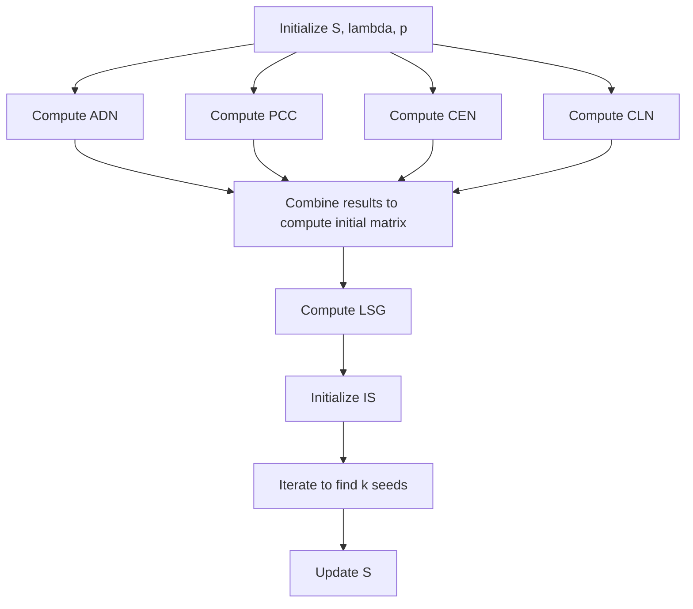

<div align="center">
    <h1>
    CenProteo: Finding the Essential Proteins in a Protein Interaction Network
    </h1>
    <p>
    Project of BIO2502 Programming Languages for Bioinformatics, 2024 Spring, SJTU
    <br />
    <a href="https://github.com/xywawawa"><strong>xywawawa</strong></a>
    &nbsp;
    <a href="https://github.com/Cannizzaro-reaction"><strong>Cannizzaro-reaction</strong></a>
    &nbsp;
    <a href="https://github.com/Imiloin"><strong>Imiloin</strong></a>
    &nbsp;
    </p>
    <p>
    <a href="https://github.com/Imiloin/CenProteo"></a>
    <a href="https://github.com/Imiloin/CenProteo?tab=MIT-1-ov-file"></a>
    </p>
    
</div>

**如何在蛋白质互作网络 (protein-protein interaction netwrok) 中寻找关键蛋白**

在过去的几十年中，对于单一蛋白质的性质及功能方面的研究取得了很大进展。但是，蛋白质在生物体内很少单独发挥作用，因此了解蛋白质之间的相互作用对于揭示复杂分子机制至关重要。近年来，酵母双杂交系统（Yeast Two-Hybrid, Y2H），交叉链接质谱法（Cross-linking Mass Spectrometry, XL-MS）等高通量实验技术快速发展，使得越来越多蛋白质之间的相互作用被研究和发表，也积累了大量的相关实验数据，由此构建出蛋白质相互作用网络（PPIN） 。在 PPIN 中，关键蛋白具有特定的拓扑位置和功能角色，对维持网络的稳定性和功能具有重要影响。为了从 PPIN 中发现关键蛋白，出现了一系列如度中心性（Degree Centrality），介数中心性（Betweenness Centrality），聚类系数（Clustering Coefficient）等传统算法。

本项目构建了包 `cenproteo` ，实现了几种计算蛋白质网络中蛋白质的中心性，并进行排序从而寻找关键蛋白质的算法。


## 🗂️ Data Source & Preprocessing

在`CenProteo` python package中的几种算法中，使用了酿酒酵母（Saccharomyces cerevisiae）的蛋白质互作信息，主要用到了以下几种数据：

* 蛋白质互作对及蛋白质GO语义相似性数值（The GO similarity value for BP, MF, and CC under the DIP PPI dataset and the combined PPI dataset）：

   基因本体论术语（Gene Ontology term）是生物信息学中用来标准化基因产品属性的一种方式，允许研究人员以一种标准化的方式注释基因和蛋白质的功能，有助于数据的共享和比较。GO术语覆盖了三个主要领域：分子功能（Molecular Function，MF），细胞组分（Cellular Component，tCC）和生物过程（Biological Process，BP）。

   数据来自文献Zhang W, Xu J, Li Y, *et al*. Detecting essential proteins based on network topology, gene expression data, and gene ontology information. *IEEE/ACM transactions on computational biology and bioinformatics*, 2016, 15(1): 109-116.支撑材料。

* 已知关键蛋白表：数据来自[DEG database](https://tubic.org/deg/public/index.php/query/eukaryotes/degac/DEG2001.html?lineage=eukaryotes&field=degac&term=DEG2001&page=1)，选择`Download > Eukaryotes > Organisms`，下载`Saccharomyces cerevisiae`的关键蛋白信息。数据处理过程如下：

   * 通过python脚本，从原文件中提取关键蛋白名称，写入新的`.csv`文件；

   * 从[STRING database](https://cn.string-db.org/cgi/input?sessionId=bWGl1KdZES6m&input_page_show_search=on)中获取两种蛋白质（基因）编码方式的名称对照表，并利用脚本得到对应的蛋白名称，写入`.csv`文档；
   * 利用得到的对应名称，对关键蛋白的名称进行更新（同时包含两种命名模式），便于后续在算法中使用。

* 基因表达量数据：

   基因表达量数据是指在特定时间、特定条件或特定细胞类型中，各个基因产生的RNA分子数量的测量数据。由于具有一定相似性的蛋白更有可能共表达，可以利用基因表达量数据计算皮尔逊相关系数（PCC），从而表明一对蛋白的相关性强弱。

   数据通过文献B. P. Tu, A. Kudlicki, M. Rowicka, and S. L. McKnight, “Logic of the yeast metabolic cycle: Temporal compartmentalization of cel- lular processes,” Science, vol. 310, no. 5751, pp. 1152–1158, Nov.2005.提供的数据编号（GSE3431），从NCBI中下载相应的基因表达量数据。处理方法如下：

   * 下载基因表达量原文件，删去数据以外的多余部分，并将数据写入`.csv`文件；
   * 对数据进行过滤，如果该蛋白不存在于酿酒酵母互作蛋白对中，则删去，其余保留；
   * 通过GSE3431数据页面进入测序平台GPL90信息页面，下载该基因表达量测定的注释文件，通过脚本将原过滤文件中的通道编号替换为对应的蛋白质编号，如不存在则删去。

* 亚细胞定位数据：

   研究表明，很多互作蛋白对都存在与细胞中的同一分区或邻近分区内。因此亚细胞定位数据对于发现关键蛋白有一定帮助。

   数据来自[COMPARTMENT database](https://compartments.jensenlab.org/Downloads)，选择`All channels integrated`中的`yeast`选项进行下载。处理方法如下：

   * 将原始数据粘贴入`.csv`文档；
   * 通过 11 个亚细胞定位分区所对应的 GO 术语，对数据进行筛选，将符合这 11 个 GO 术语的数据保存到新的`.csv`文件，用于后续计算。

* 基因同源性数据：

   研究发现，蛋白质的关键程度与其在进化中的保守性有一定关系。如果一个蛋白在多个物种中具有同源蛋白，则该蛋白更有可能为关键蛋白。

   数据来自[InParanoid database (version 7)](https://inparanoid8.sbc.su.se/download/old_versions/data_7.0/)，选择`sqltables.tgz`进行下载，后续处理如下：

   * 解压文件，利用脚本选择与酿酒酵母有关的数据保存，写入`.csv`文件，删去其余文件；
   * 通过脚本遍历筛选得到的每个文件，筛选同源性100%的基因编号保存，并计算每一种同源基因编号在不同物种中出现的次数，计入`.csv`文档。


## 🗝️ Algorithms

蛋白质网络通常表示为一个无向图 $G=(V, E)$，节点 $u\in V$ 表示一个蛋白质，边 $(u,v) \in E$ 表示两个蛋白质之间的相互作用。我们用 $N$ 表示图中节点总数， $A$ 表示图的邻接矩阵。

根据使用的数据类型，算法可以大致分为以下几类：

#### 传统算法

仅使用网络拓扑数据（`CenProteo` 中实现的 `classical algortihms`）计算蛋白质的中心性：

+ DC（degree centrality）度中心性：一个节点 $u$ 的度中心性 $DC(u)$ 是其连接的边数。

    $$DC(u) = \sum_{v} a_{u,v}$$

+ BC（Betweenness Centrality）介数中心性：一个节点 $u$ 的介数中心性 $BC(u)$ 定义为通过节点 $u$ 的最短路径的平均比例。

    $$BC(u) = \sum_{s} \sum_{t} \frac{\rho(s, u, t)}{\rho(s, t)}, \quad s \neq t \neq u$$

    $\rho(s, t)$ 指的是 $s$ 和 $t$ 之间的最短路径数目， $\rho(s, u, t)$ 指的是 $s$ 和 $t$ 之间的最短路径中经过 $u$ 的数目。

+ EC（Eigenvector Centrality）特征向量中心性：一个节点 $u$ 的特征向量中心性 $EC(u)$ 定义为 $A$ 的主特征向量的第 $u$ 分量。

    $$EC(u) = \alpha_{\max}(u)$$

    $\alpha_{\max}$ 指的是 $A$ 的最大值对应的特征向量， $\alpha_{\max}(u)$ 指的是 $\alpha_{\max}$ 的第 $u$ 个分量。

+ SC（Subgraph Centrality）子图中心性：一个节点 $u$ 的子图中心性 $SC(u)$ 衡量的是节点 $u$ 参与的整个网络中子图的数量。

    $$SC(u) = \sum_{l=0}^{\infty} \frac{\mu_{l}(u)}{l!}$$

    $\mu_{l}(u)$ 指的是开始并结束于节点 $u$ 且长度为 $l$ 的环路数目。

+ IC（Information Centrality）信息中心性：一个节点 $u$ 的信息中心性 $IC(u)$ 衡量的是以节点 $u$ 结束的路径长度的调和平均值。

    $$IC(u) = \left[\frac{1}{N} \sum_{v} \frac{1}{I_{uv}}\right]^{-1},I_{uv} = (c_{uu} + c_{vv} - c_{uv})^{-1},C = (c_{uv}) = [D - A + J]^{-1}$$

    $D$ 为每个节点度的对角矩阵， $C$ 是改进的邻接矩阵， $J$ 是所有元素都为 1 的矩阵。

    在 `CenProteo` 中，为简化计算，信息中心性通过计算 `curent flow centrality` 来近似。

+ CC（Closeness Centrality）接近中心性：一个节点 $u$的接近中心性 $CC(u)$ 是从节点 $u$ 到网络中所有其他节点的图理论距离之和的倒数。

    $$CC(u) = \frac{N - 1}{\sum_{v} d(u, v)}$$

    $d(u,v)$ 指的是从节点 $u$ 到结点 $n$ 的距离。

+ NC（Neighbor Centrality）邻居中心性：节点 $u$ 的邻域中心性 $NC(u)$ 定义为节点 $u$ 邻居之间的边聚类系数（Edge Clustering Coefficient, ECC）之和。

    $$NC(u) = \sum_{v \in N_u} ECC(u, v),$$ 
    $$ECC(u, v) = \frac{z_{u, v}}{\min(d_u - 1, d_v - 1)},$$
    $$z_{u, v} = \sum_{w} A_{uw} A_{vw}.$$

    边聚类系数 $ECC(u, v)$ 表示节点 $u$ 和节点 $v$ 之间的共同邻居数 $z_{u, v}$ 与两者度数的最小值之比， $A_{uw}$ 和 $A_{vw}$ 分别表示节点 $u$ 和 $v$ 是否与节点 $w$ 相连。

   

#### 现代算法

使用网络拓扑数据和基因表达量等生物数据，主要实现以下几种方法：

+ TGSO algorithm：


​		计算流程框架：



  reference: Li S, Zhang Z, Li X, *et al*. An iteration model for identifying essential proteins by combining comprehensive PPI network with biological information. *BMC bioinformatics*, 2021, 22: 1-25.https://doi.org/10.1186/s12859-021-04300-7

+ JDC algorithm：
  


  reference: Zhong, J., Tang, C., Peng, W. *et al.* A novel essential protein identification method based on PPI networks and gene expression data. *BMC Bioinformatics* 22, 248 (2021). https://doi.org/10.1186/s12859-021-04175-8
  
+ TEO algorithm：


  
  reference: Zhang W, Xu J, Li Y, *et al*. Detecting essential proteins based on network topology, gene expression data, and gene ontology information. *IEEE/ACM transactions on computational biology and bioinformatics*, 2016, 15(1): 109-116.https://ieeexplore.ieee.org/document/7586077


## 🔧 Installation

#### Clone this repo

```bash
git clone https://github.com/Imiloin/CenProteo.git
cd CenProteo
```

#### Setup

```bash
pip install -e .
```

## ♾️ Usage

#### classical algorithms
* 导入classical_algorithms模块，选择算法（这里以DC为例）并计算得到排序后网络中所有蛋白质的中心性分数：
  ```python
  from cenproteo import classical_algorithms
  class_test = classical_algorithms(<path_to_ppi_file>)
  dc_sorted_score = class_test.DC()
  ```
  
* 将结果存储为`.csv`文件：
  ```python
  class_test.export_result_to_csv(dc_sorted_score, <path_to_save_result>)
  ```
  
* 如果有金标准文件，将算法得到的关键蛋白质与金标准进行比较，输出n个关键蛋白质中预测正确的个数：
  ```python
  class_test.first_n_comparison(n, dc_sorted_score, <path_to_real_essential_protein_file>)
  ```
#### JDC algorithm, TGSO algorithm and TEO algorithm
以JDC模块为例，TGSO模块和TEO模块用法与JDC模块相同。
* 导入JDC模块，运用JDC算法计算得到排序后网络中所有蛋白质的JDC中心性分数：
  ```python
  from cenproteo import JDC
  JDC_test =  JDC(<path_to_ppi_file>, <path_to_gene_expression_file>)
  jdc_sorted_score = JDC_test.calculate_jdc()
  ```
  
* 将结果存储为`.csv`文件：
  ```python
  JDC_test.export_result_to_csv(jdc_sorted_score, <path_to_save_result>)
  ```

* 如果有金标准文件，将算法得到的关键蛋白质与金标准进行比较，输出n个关键蛋白质中预测正确的个数：
  ```python
  JDC_test.first_n_comparsion(n, jdc_sorted_score, <path_to_real_essential_protein_file>)
  ```

## 📈 Results & Comparison

将`CenProteo` python package中的几种算法进行对比，当选择不同的n进行测试时，得分最高的前n个蛋白中正确的关键蛋白数量如下：


分别取N=100，200，400进行对比：


其中TGSO算法的正确性略高于其他算法，且当所选取的n值较小时，各算法的准确性相对较高。
